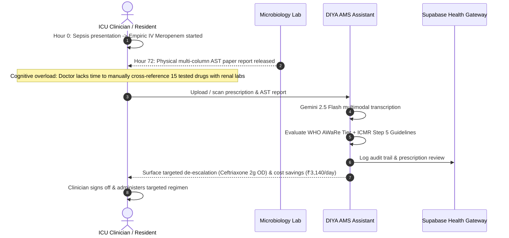
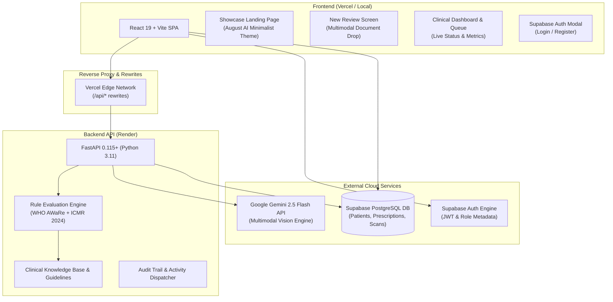
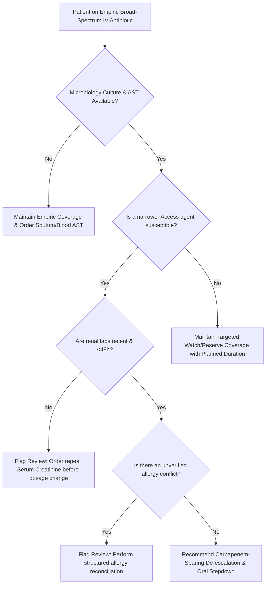

<div align="center">


### **Diagnostic Intelligence & Antibiotic Review Assistant**
*An evidence-grounded, multimodal clinical decision-support system (CDSS) for global hospital antimicrobial stewardship.*

[](https://vercel.com)
[](https://diyaaa.onrender.com)
[](https://aistudio.google.com)
[](https://supabase.com)
[](LICENSE)

[Live Demo](https://diyaaa.onrender.com) · [API Documentation](https://diyaaa.onrender.com/docs) · [Report Bug](https://github.com/ut3av/MLH/issues)

<br />


</div>

---

## 📑 Table of Contents
- [Executive Overview](#-executive-overview)
- [The Clinical Crisis & Rationale](#-the-clinical-crisis--rationale)
- [Key Features](#-key-features)
- [Clinical Demonstration Reports & AI Prompts](#-clinical-demonstration-reports--ai-prompts)
- [System Architecture](#-system-architecture)
- [Stewardship Decision Logic & Guidelines](#-stewardship-decision-logic--guidelines)
- [Technology Stack](#-technology-stack)
- [Supabase Database Schema](#-supabase-database-schema)
- [Local Setup & Development](#-local-setup--development)
- [Deployment Guide](#-deployment-guide)
- [Compliance & Medical Disclaimers](#-compliance--medical-disclaimers)

---

## 🌟 Executive Overview

**DIYA** (*Diagnostic Intelligence & Antibiotic Review Assistant*) is an enterprise clinical cognitive copilot designed to eliminate the critical documentation bottleneck fueling Antimicrobial Resistance (AMR) in hospitals.

By fusing **Google Gemini 2.5 Flash's multimodal vision engine** with **deterministic WHO AWaRe and ICMR 2024 antimicrobial rules**, DIYA ingests unstructured doctor prescriptions, microbiological blood/urine culture AST printouts, and biochemistry reports—automatically cross-referencing renal clearance, allergy history, and isolated pathogens to formulate safe, cost-effective de-escalation recommendations.

```
+--------------------------+       +-------------------------+       +----------------------------+
|  Hospital Paperwork      |  ==>  |  Multimodal Gemini OCR  |  ==>  |  ICMR/WHO De-escalation    |
|  (Handwriting, AST Labs) |       |  (Zero-Hallucination)   |       |  (Targeted Prescription)   |
+--------------------------+       +-------------------------+       +----------------------------+
```

---

## 🚨 The Clinical Crisis & Rationale

### 1. The Global AMR Epicenter
Antimicrobial Resistance threatens to make minor infections and routine surgeries fatal. The **Indian Council of Medical Research (ICMR)** reports that:
- **Up to 59% of *E. coli*** isolates produce Extended-Spectrum Beta-Lactamases (ESBL+).
- **Up to 30% of ICU isolates** are carbapenemase-resistant superbugs.
- Lacking rapid bedside decision support, physicians often continue broad-spectrum carbapenems (e.g. *Meropenem*) indefinitely.

### 2. The De-escalation Chasm at Hour 72


---

## ⚡ Key Features

- 👁️ **Multimodal Prescription & AST OCR**: High-precision recognition of handwritten doctor notations (`TDS`, `BD`, `OD`), trade names, and dot-matrix AST culture tables using **Google Gemini 2.5 Flash**.
- 🧬 **Targeted Carbapenem-Sparing De-escalation**: Formulates immediate step-downs from broad-spectrum Reserve/Watch agents (e.g. Meropenem) to narrower Access agents (e.g. Nitrofurantoin, Ceftriaxone, Cefepime).
- 🛡️ **Deterministic Safety Safeguards**:
  - **Renal Function Guard**: Flags outdated serum creatinine (>48h) or renal impairment before clearance calculations.
  - **Allergy Distinction**: Segregates unknown historical rashes from confirmed IgE-mediated anaphylaxis (`UNKNOWN` $\neq$ `NEGATIVE`).
  - **Document Discrepancy Detector**: Reconciles conflicting orders between nursing notes and admission charts.
- 🗄️ **Supabase Audit Trail & Patient Tracking**: Persistent inpatient tracking, prescription histories, and audit logging protected by PostgreSQL Row Level Security (RLS).
- 🖨️ **1-Click Clinical Print Brief**: Generates verifiable, branded hospital decision-support summaries for patient bedside records.
- 🎨 **Minimalist August AI-Inspired UI**: Custom liquid-glass navigation, ambient mouse spotlight tracking, floating biological SVGs, and responsive dark/light themes.

---

## 📄 Clinical Demonstration Reports & AI Prompts

DIYA includes three authentic, hospital-grade clinical test reports (with micro-organism identification, automated CLSI M100 antibiograms, and renal biomarker panels) that demonstrate how patient-specific factors drive the safest, targeted antimicrobial prescription.

### 1. Downloadable Clinical Demonstration PDFs
These files are stored directly in the repository and available via 1-click download on the live website:

| Scenario | Patient | Clinical Presentation & Specimen | Empiric Regimen | Targeted Antibiotic & Impact | Download Link |
|:---|:---|:---|:---|:---|:---:|
| **Case 1 (Bacteremia)** | `PT-1042` (62/M) | Blood culture: *E. coli* susceptible to Ceftriaxone & Meropenem. Creatinine: 1.8 mg/dL. | **Meropenem 1g IV TDS** | **Ceftriaxone 2g IV OD**<br>• Spares carbapenems<br>• Saves ₹3,140/day | [📥 Download PDF](amr-guard/frontend/public/sample_reports/pt1042_blood_culture_report.pdf) |
| **Case 2 (Complicated UTI)** | `PT-1039` (54/F) | Urine culture: *K. pneumoniae* susceptible to Nitrofurantoin. Normal creatinine (1.1). | **Pip-Taz 4.5g IV TDS** (Day 6 timeout) | **Nitrofurantoin 100mg PO QID**<br>• Early IV-to-PO switch<br>• WHO Access Tier | [📥 Download PDF](amr-guard/frontend/public/sample_reports/pt1039_urine_ast_prescription.pdf) |
| **Case 3 (Surgical SSI)** | `PT-1035` (70/M) | Deep wound: *P. aeruginosa*. Chart conflict: ER noted Penicillin Anaphylaxis vs Ward NKDA. | **Meropenem vs Pip-Taz** (Chart Discrepancy) | **Cefepime 2g IV q8h**<br>• Targeted antipseudomonal<br>• Allergy safety check | [📥 Download PDF](amr-guard/frontend/public/sample_reports/pt1035_wound_surgical_chart.pdf) |

### 2. Standalone PDF Report Generator Script
To re-generate or customize these medical laboratory reports programmatically with high-fidelity vector tables and hospital letterheads, use the included Python script:

```bash
# Generates all 3 clinical demonstration PDFs in public/ and assets/
python generate_sample_pdfs.py
```
> See [`generate_sample_pdfs.py`](generate_sample_pdfs.py) for the complete procedural generation code.

---

### 3. Production Gemini 2.5 Flash Multimodal OCR Prompt
When documents are dragged into DIYA, Google Gemini 2.5 Flash executes the following system instruction to guarantee deterministic clinical transcription and ICMR/WHO AWaRe-grounded recommendation:

```text
You are an expert infectious-disease physician and clinical antimicrobial stewardship pharmacist.
Thoroughly read and parse this uploaded medical document (which may be a doctor's handwritten or 
printed prescription, culture & AST antibiogram, laboratory panel, or discharge/ward chart).

TASK:
1. Extract all legible patient facts: patient name/alias, age, sex, hospital ward/bed, and clinical infection site.
2. Identify any isolated pathogen(s) and full antimicrobial susceptibility testing (AST) results (which antibiotics 
   are Susceptible 'S', Intermediate 'I', or Resistant 'R').
3. Extract currently prescribed medications (especially antibiotics, dose, route, frequency).
4. Extract documented patient allergies and renal/hepatic markers (e.g., serum creatinine, eGFR).
5. Formulate an evidence-grounded, safer, and narrower antibiotic recommendation adhering to WHO AWaRe 2024 
   and ICMR Antimicrobial Guidelines:
   - If an overly broad drug (like Meropenem or Vancomycin) is prescribed while narrower active options exist in AST, 
     suggest a targeted de-escalation (e.g. Ceftriaxone, Nitrofurantoin, Amikacin).
   - If renal impairment is detected (e.g. CrCl/eGFR < 50 or Creatinine > 1.5), specify required renal dose adjustments.
   - If allergy risks exist (e.g. Penicillin rash/anaphylaxis), verify cross-reactivity and flag safety concerns.

RETURN STRICTLY RAW JSON:
{
    "patient_alias": "PT-XXXX or Patient Name from document",
    "age": "age in years or null",
    "sex": "Male / Female / null",
    "ward": "ward/bed or 'Inpatient Ward'",
    "infection_site": "Bloodstream (Bacteremia) / Complicated UTI / Surgical Site / etc.",
    "prescribed_antibiotics": [{ "drug_name": "...", "dosage": "...", "frequency": "...", "route": "..." }],
    "culture_ast_findings": {
        "organism": "...",
        "colony_count": "...",
        "susceptible_drugs": ["..."],
        "resistant_drugs": ["..."]
    },
    "allergies": [{ "allergen": "...", "reaction": "..." }],
    "renal_markers": { "serum_creatinine": "...", "egfr": "...", "tested_recency": "..." },
    "recommended_antibiotic": {
        "drug_name": "Best targeted antibiotic (e.g. Ceftriaxone)",
        "dosage": "e.g. 2g",
        "route": "IV or Oral",
        "frequency": "Once daily (OD)",
        "duration": "7 to 10 days",
        "clinical_rationale": "Clear clinical justification referencing pathogen susceptibility and patient clearance.",
        "who_aware_category": "Access / Watch / Reserve",
        "safety_precautions": "Safety monitoring for renal clearance and allergy confirmation."
    },
    "raw_ocr_snippet": "Key readable lines transcribed verbatim",
    "confidence": 0.95
}
```

---

## 🏗️ System Architecture



---

## ⚖️ Stewardship Decision Logic & Guidelines

DIYA strictly complies with:
1. **WHO AWaRe 2024 Classification**:
   - **Access**: First- and second-choice therapies offering high therapeutic value with minimal resistance risk.
   - **Watch**: Higher resistance potential; prioritized for antimicrobial stewardship monitoring.
   - **Reserve**: "Last-resort" options (e.g., Colistin, Linezolid) strictly reserved for confirmed MDR pathogens.
2. **ICMR 2024 Guidelines for Antimicrobial Use in Common Syndromes**:
   - Mandates formal **48-to-72 hour Antimicrobial Timeouts**.
   - Enforces **Step 5: De-escalation** once pathogen susceptibility is documented.



---

## 🛠️ Technology Stack

| Layer | Technologies | Purpose |
|---|---|---|
| **Frontend UI** | **React 19**, **Vite 8**, **Tailwind CSS 3** | Responsive, liquid-glass clinical workstation |
| **Icons & Brand** | **Lucide React**, Custom Alpha PNGs/SVGs | Handcrafted Diya brand identity & typography |
| **Backend API** | **Python 3.11**, **FastAPI 0.115+**, **Uvicorn** | High-concurrency clinical asynchronous REST service |
| **Multimodal AI** | **Google GenAI SDK**, **Gemini 2.5 Flash** | Prescription handwriting and AST dot-matrix OCR |
| **Database & Auth** | **Supabase**, **PostgreSQL**, **@supabase/supabase-js** | RLS-protected database, authentication, audit log |
| **Validation** | **Pydantic v2** | Strict schema validation for clinical responses |
| **Deployment** | **Vercel** (Frontend) & **Render** (Backend API) | Zero-downtime global edge distribution |

---

## 🗄️ Supabase Database Schema

The production schema is managed via [`supabase_schema.sql`](supabase_schema.sql):

- **`public.patients`**: Inpatient demographics, ward, admission timestamp, infection site, and review status.
- **`public.prescriptions`**: Active and completed antibiotic courses, route, dosage, frequency, and prescribing physician.
- **`public.ocr_scans`**: Uploaded lab charts, category, raw text, and structured Gemini JSON facts.
- **`public.clinical_activity`**: Audit trail capturing reviews, timeout triggers, and de-escalation actions.

---

## 💻 Local Setup & Development

### 1. Clone the Repository
```bash
git clone https://github.com/ut3av/MLH.git
cd MLH
```

### 2. Backend Setup
```bash
cd amr-guard/backend
python -m venv venv
# Windows:
venv\Scripts\activate
# Linux/macOS:
source venv/bin/activate

pip install -r requirements.txt
```

Create a `.env` file in `amr-guard/backend/`:
```env
GEMINI_API_KEY=your_gemini_api_key_here
SUPABASE_URL=https://your-project.supabase.co
SUPABASE_KEY=your_supabase_anon_key
PORT=8000
HOST=0.0.0.0
```

Start the backend:
```bash
python main.py
# Server starts on http://localhost:8000 (Swagger docs at /docs)
```

### 3. Frontend Setup
```bash
cd ../frontend
npm install
```

Create a `.env` file in `amr-guard/frontend/`:
```env
VITE_API_BASE=http://localhost:8000
VITE_SUPABASE_URL=https://your-project.supabase.co
VITE_SUPABASE_ANON_KEY=your_supabase_anon_key
VITE_GEMINI_API_KEY=your_gemini_api_key_here
```

Start the frontend dev server:
```bash
npm run dev
# Vite runs on http://localhost:5173
```

---

## 🚀 Deployment Guide

### A. Backend on Render
1. Create a new **Web Service** on [Render.com](https://render.com).
2. Connect your repository (`MLH`), branch `main`.
3. Set **Root Directory**: `amr-guard/backend`.
4. Set **Build Command**: `pip install -r requirements.txt`.
5. Set **Start Command**: `uvicorn main:app --host 0.0.0.0 --port $PORT`.
6. Add Environment Variables: `GEMINI_API_KEY`, `SUPABASE_URL`, `SUPABASE_KEY`.

### B. Frontend on Vercel
1. Import repository on [Vercel](https://vercel.com).
2. Root Directory: `amr-guard/frontend` (or root with repository's `vercel.json`).
3. Framework Preset: `Vite`.
4. Add Environment Variables:
   - `VITE_API_BASE=https://diyaaa.onrender.com`
   - `VITE_SUPABASE_URL=https://your-project.supabase.co`
   - `VITE_SUPABASE_ANON_KEY=your_supabase_anon_key`
   - `VITE_GEMINI_API_KEY=your_gemini_api_key`
5. Click **Deploy**.

---

## 🛡️ Compliance & Medical Disclaimers

> [!IMPORTANT]
> **Clinical Decision-Support System (CDSS) Disclaimer:**
> DIYA is designed strictly for investigational decision support and clinical education. It prepares synthesized evidence, verifies guidelines, and surfaces actionable stewardship opportunities. **It does not autonomously prescribe medications.** All recommendations, dose adjustments, and de-escalation regimens must be reviewed and countersigned by a licensed medical practitioner or clinical pharmacist before administration.

---

## 👥 Contributors & Acknowledgements
- **Team DIYA** — Built for Major League Hacking (MLH).
- Built with Google Gemini 2.5 Flash, Supabase, FastAPI, and Vite.
- Guidelines synthesized from ICMR Antimicrobial Guidelines (2024) & WHO AWaRe Classification (2024).
